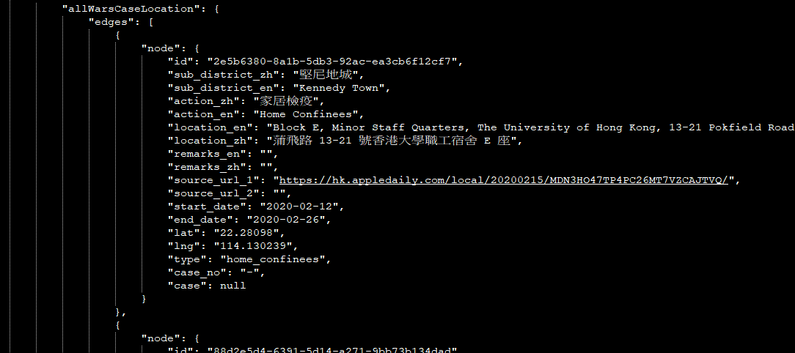
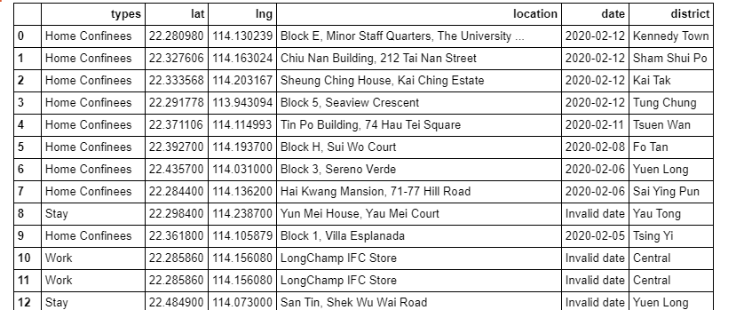
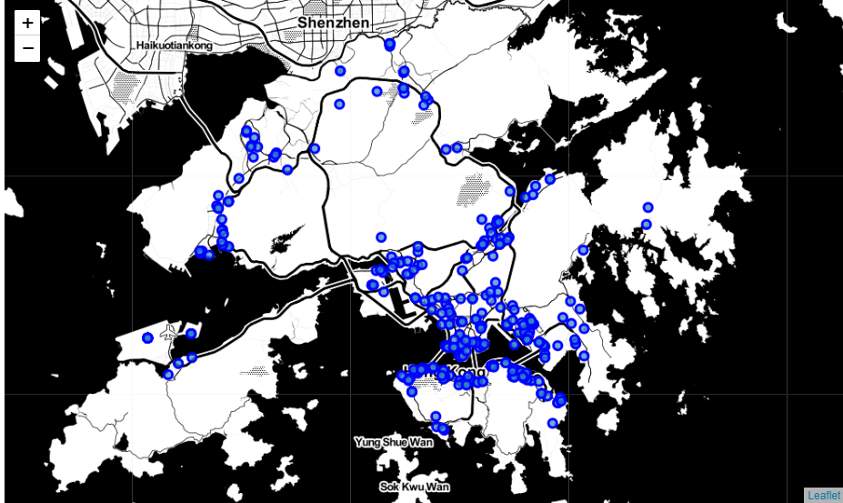
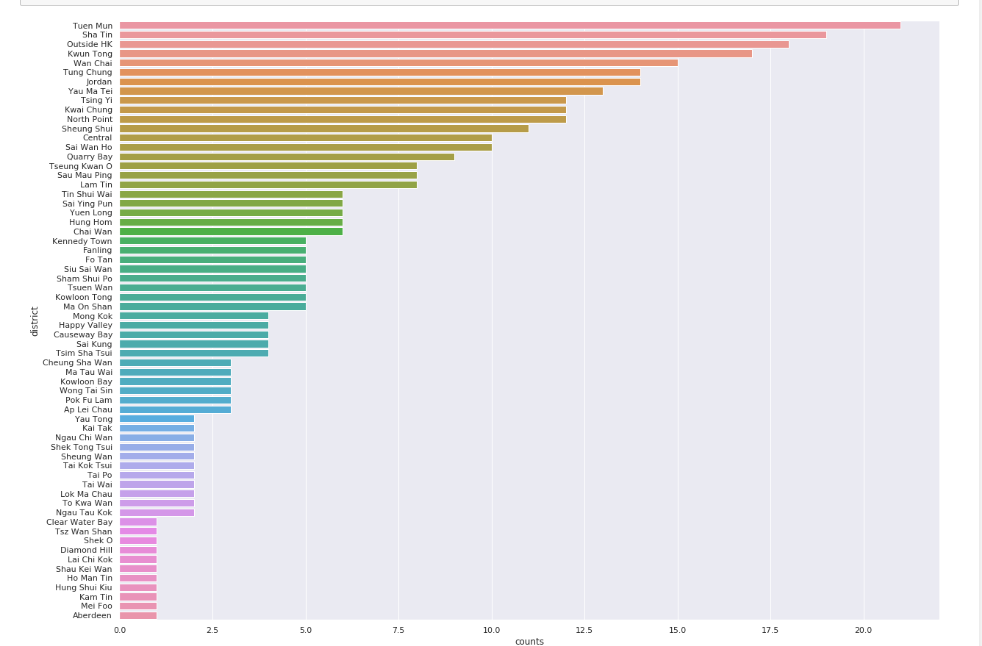
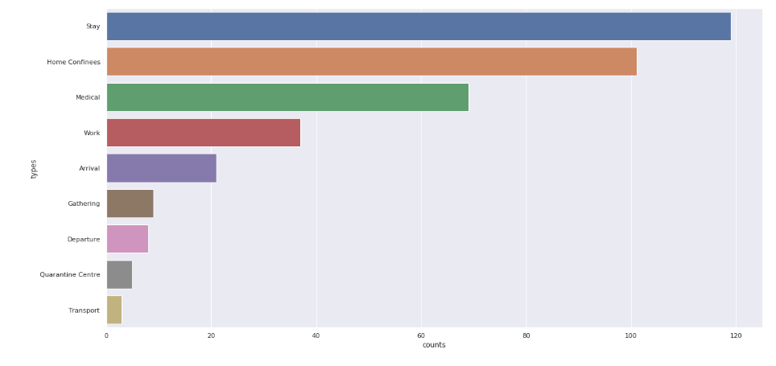
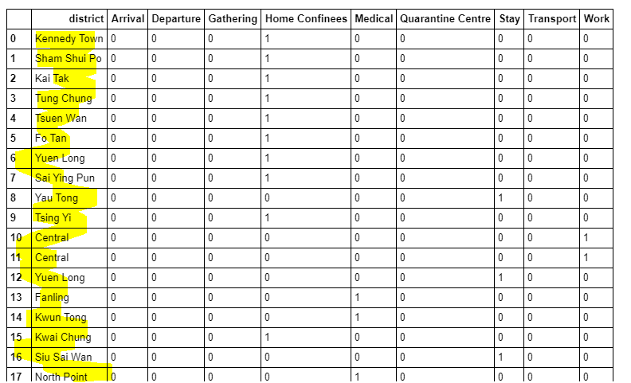
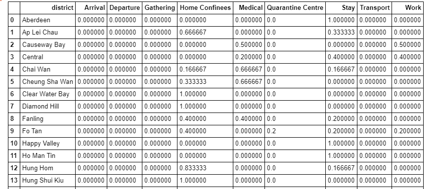
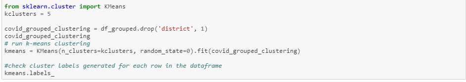
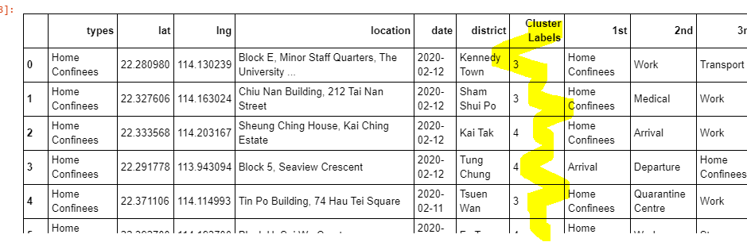
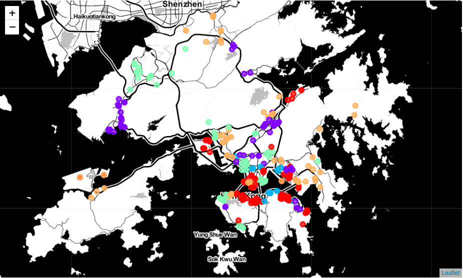

# 2019-nCoV High Risk Area in Hong Kong 

# Description of the problem
This project is a Coursera projects for education purpose only. Human-to-human transmission of the virus has been confirmed. This project is using a K-means clustering to identify the high-risk area located in Hong Kong. The K-means will using the data from Hong Kong government who have been identified or suspected. As Health officials say all patients placed into isolation in Hong Kong because they have – or are suspected. Moving into that area will having a higher risk to inflected by 2019-nCov.The result of this report will give a high-risk area that tourists or public should avoid to the high-risk area.

# Data Requirements
Hong Kong Government release the 2019-nCov data every day from https://chp-dashboard.geodata.gov.hk/nia/en.html . The current study is based on 22th Feb 2020. From the data, we know there are different type of inflections.

1. Home Confines - It is a suspected case or having symptom of fever.
2. Stay - Inflected by relative or friends.
3. Work - Inflected during work.
4. Medical - It is a suspected case reported by clinic or hospital.
5. Gathering - Inflected by relative or friends during a gathering or meals.
6. Arrival /Departure - Inflected during and have travel out of Hong Kong history.
7. Quarantine center - It is a suspected case which are quarantined due to have close relation with an inflected person.

# Data Preparation

The data itself is a JSON file. For this, I’ve used pandas to transform the data in a data frame for data preparation

Missing value Handling - The data itself have some missing data. Missing values are removed from the data sets for training.

Data normalization – for  k-Means weights each dimension should be mean and hence the data taken to ensure that unit of dimension shouldn’t distort.

After preparation of data, the data-frame is obtained as below:
1. types - category for the Co-vid in Hong Kong
2. lat - Latitude of the reported cases
3. lng - Longitude of the reported cases
4. location - the full address of the reported case
5. date - reported date
6. district - deduces from the full address, Hong Kong major district area.

# Analysis the data 

After the data preparation process, I used python folium library to visualize geographic details of reported case and its
districts and I created a map of using the latitude and longitude values to get the visual as below:

Later on, have some high-level visualization of the data. I use the python library seaborn to plot a bar chart/
X axis - number of reported cases
Y axis - major distinct in Hong Kong

For the result, it shows Tuen Mun has the highest reported case of Covid. So, we should avoid going to this area for safety.

The third chart is showing the infection type. As the result, it shows around 120 people are inflected by their family or friends who have close relationship with the patient.

After the high-level visualization of the data, then I am normalization the data for k-means training.
First, we need to normalize the data to 0 or 1 using one hot encoding. 0 indicates nonexistent while 1 indicates existent.

then use pandas group by on districts column and calculate the mean of the frequency of occurrence of each types.

After 5 hours of preparation and understand the data, and now, the data frame are ready for K-mean clustering.

# Data training

Finally, we try to cluster these inflected types based on the districts area and use K-Means clustering. So, our expectation would be based on the similarities of types, these districts will be clustered. I have used the code below:

After k-means training, I got below labeling from the result.
<pre>
array([0, 3, 2, 0, 1, 1, 3, 3, 1, 4, 0, 0, 3, 3, 4, 4, 3, 3, 2, 1, 4, 0,
       2, 4, 4, 0, 2, 4, 2, 4, 1, 2, 0, 1, 0, 4, 0, 4, 1, 1, 3, 2, 0, 3,
       4, 0, 0, 3, 1, 3, 3, 0, 4, 0, 0, 3, 0, 1, 4, 0, 3, 0, 0, 3],
      dtype=int32)
</pre>

Then we merged the cluster label to original data frame and use it to plot the location on Folium.

I can represent these five clusters in a leaflet map using Folium library as below:

After visualization the data on Folium, we know the green and blue are relatively high-risk area, because the patients are in home confines.

# Conclusion
In a fast-moving world, there are many real-life problems or scenarios where data can be used to find solutions to those problems. Like seen in the example above, data was used to cluster the inflection type in Hong Kong based on the reported case by government and the major districts. The results can help a traveler to decide to avoid going to this high-risk area. 
(The results are for educational purposes only)

